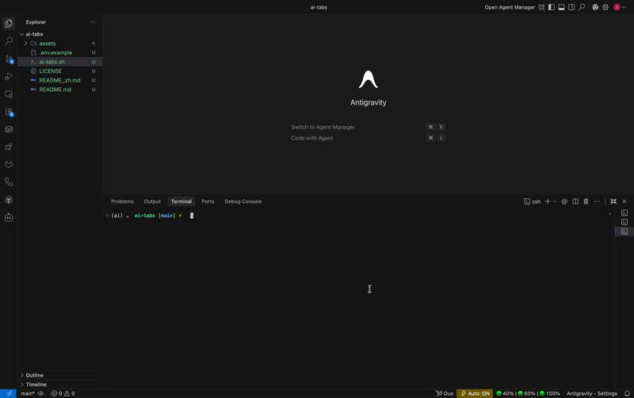

# ai-tabs (macOS) 🚀

> **One AI agent? You rest while it thinks. Multiple agents? Now YOU never rest either. 😂**

[English](README.md)| [简体中文](README_zh.md)

[](LICENSE)
[](#)
[](#)

## 🎥 Demo



## 💡 Why ai-tabs?

In the era of AI-driven development, programmers face several key challenges:
1. **Quota Anxiety**: Individual AI tools (like Claude or Gemini) have limited free tiers and frequently hit rate limits.
2. **Model Bias**: No single model is perfect; complex tasks often require cross-checking and switching between different providers.
3. **Context Friction**: Switching between various terminal windows is clunky and breaks your "flow."

**ai-tabs ensures "No Rest for Agents"**: By orchestrating multiple AI CLIs into VS Code editor tabs, you can switch between AI Agents as easily as switching code files.

### Key Value Props:
- **Zero Context-Switching Friction**: No more jumping between standalone terminal apps or browser tabs. Your AI workspace lives right next to your code.
- **Multi-Agent Synergy**: 
    - Use **Claude** for high-level refactoring;
    - Use **Gemini** to simultaneously generate unit tests;
    - Use **OpenCode** to profile performance bottlenecks in real-time.
- **Maximize Free Quotas**: Seamlessly relay tasks between different providers. If one hits a rate limit, simply click the next tab and keep moving.

> [!TIP]
> **Free Tier Strategy**: While Claude Code lacks a native free tier, you can use a **Gemini API Key** (via Google AI Studio's free monthly quota) with open-source Gemini CLI tools to achieve a completely free Multi-Agent workflow.

## 🌟 Key Features

- **"Editor-as-UI"**: Terminals aren't buried in the bottom panel; they live directly as **Editor Tabs**.
- **Hybrid Discovery Engine**: Automatically scans standard paths (PATH, Brew, NPM, NVM, etc.) while supporting `.env` for custom overrides.
- **Self-Healing Startup**: Attempts to resume your last session (`--continue`/`--resume`); falls back to a fresh one if no history exists.
- **Turbo Automation**: Leverages AppleScript + Clipboard bridge for a zero-config, lightning-fast batch launch.
- **Zero Overhead**: Minimalist Bash script using `exec` to keep your workspace lean and fast.

## 🛠 Auto-Discovered Tools

The system auto-detects several popular CLIs and applies the following resume logic:

| AI CLI Tool | Resume Strategy | Notes |
| :--- | :--- | :--- |
| **Claude Code** | `--continue` | Official Anthropic CLI |
| **OpenCode** | `--continue` | High-speed reasoning |
| **Gemini CLI** | `--resume latest` | Google's Multimodal power |
| **GitHub Copilot** | `--continue` | Native GitHub support |
| **iFlow CLI** | `--continue` | Structured task handling |
| **Cline CLI** | `--continue` | Open-source Agent expert |
| **Kimi CLI** | `--continue` | Long-context specialist |
| **Codex CLI** | `resume --last` | Classic coding assistant |
| **Kilo CLI** | `--continue` | Lightweight inference |

## 🚀 Quick Start

### 1. Prerequisites
- **OS**: macOS
- **Editor**: VS Code
- **Setup**: None! No manual shortcut binding required.

### 2. Deployment & Usage

Download the script to your project root, make it executable, and run it:

```bash
# Clone the repository
git clone https://github.com/Fu-Jie/ai-tabs.git

# Make executable and run
chmod +x ai-tabs/ai-tabs.sh
./ai-tabs/ai-tabs.sh
```

## ⚙️ How it Works

`ai-tabs` automates the "manual friction" using AppleScript:
1. Triggers the Command Palette (`Cmd+Shift+P`).
2. Executes "Terminal: Create New Terminal in Editor Area."
3. Injects the specific AI start command and restores the session.
4. Orchestrates everything in seconds, building your full AI Command Center.

## 📜 License

MIT License.
